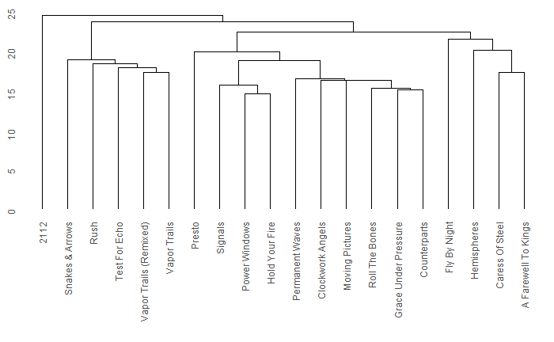

```{r setup, include=FALSE}
knitr::opts_chunk$set(echo = FALSE)

# Load libraries (every time)

library(tidyverse)
library(flexdashboard)
library(spotifyr)
library(dplyr)
library(ggplot2)
library(reshape2)
library(dbscan)
library(factoextra)
library(plotly)
library(compmus)
library(tidymodels)
library(ggdendro)
library(heatmaply)
library(protoclust)

# Set Spotify access variables (every time)
rm(list = ls())

load("Corpus.RData")
load("spotify_env.RData")

set_spotify_ID()
```

<!--
TODO
  - Kijken of PCA wat heeft toegevoegd aan live/studio classificatie
  - Chroma feature analysis van clusters doen zoals nu de timbre (IPV self similarity?)
  - Kijken of andere classificatie door delta en deltadelta gebruiken?
  - tempoanalyseplot mooi kleurschema uitkiezen
-->

Introduction
===

Column
---

### The Canadian Rock, Metal and What Have You band
The Canadian band [Rush](https://bit.ly/2HkT2Sx) is at its heart a rock band. However, during the extensive lifetime of Rush, its music found a lot of influence from a wide scope of genres and music styles. With a lifespan of more than 40 years and a total of 19 studio albums, a lot has changed from begin to end. 
In this portfolio, I will try to analyze the way Rush's music changed over the years, and I will try to determine different style periods accross its albums. Furthermore, I will look at how different genres apply to different eras of Rush. 

Column
---

### The Corpora 
Of course, the most important corpus I will use is that containing the audio features of the entire discography of Rush itself. Upon initial inspection, I decided to remove the album "2112 - 40 Years Closer: A Q&A With Alex Lifeson And Terry Brown Commentary" as it contains commentary and is thus not relevant to my analysis. 
Furthermore, I looked at different genres that are said to be part of at least some era of Rush. For each of these genres I collected the audio features of a playlist that seemed most representative for that genre. I chose playlists of the following genres:

 * Rock:
    + 70s Rock Anthems
    + 80s Rock Anthems
    + 90s Rock Anthems
    + 00s Rock Anthems
 * Progressive Rock (user-made playlist)
 * Pop Rock (Pop Rock Shot)
 * Reggae (Reggae Classics)
 * New Wave (Is it New Wave?)
 * Jazz (Jazz Classics)
 * Metal (Metal Essentials)
 * Symphonic Metal (user-made playlist)
 
I chose a total of four playlists for the Rock genre, so that I can analyse whether Rush followed the general trend of rock music through the years. 

Initial Data Exploration {.storyboard}
===

### First, I performed an __initial analysis__ of the __basic features__ of the studio albums
```{r plot, include=TRUE, fig.align="center"}
plot <-
rush_features_by_album %>% 
  filter(is_studio) %>% 
    ggplot(aes(x=studioalbum_idx)) +
      geom_line(aes(y=danceability, colour="danceability")) + 
      geom_line(aes(y=energy, colour="energy")) + 
      geom_line(aes(y=speechiness, colour="speechiness")) + 
      geom_line(aes(y=acousticness, colour="acousticness")) + 
      geom_line(aes(y=instrumentalness, colour="instrumentalness")) + 
      geom_line(aes(y=liveness, colour="liveness")) + 
      geom_line(aes(y=valence, colour="valence")) + 
      scale_x_continuous(
        name="Studio album idx",
        breaks=c(1:length(rush_studioalbum_idx)), 
        labels=c(1:length(rush_studioalbum_idx)),
        limits=c(1,20)) +
      scale_y_continuous(
        name="Value",
        breaks=c(0:10)/10, 
        labels=c(0:10)/10,
        limits=c(0,1)) +
      ggtitle("Mean of music features per studio album") +
      labs(color="Property")

ggplotly(plot)
```

***

I analyzed the audio features of each studio album of Rush, to see whether there are some easily spottable trends in there. The studio albums are, in order of release date:

1. Rush (1974)
2. Fly By Night (1975)
3. Caress of Steel (1975)
4. 2112 (1976)
5. A Farewell to Kings (1977)
6. Hemispheres (1978)
7. Permanent Waves (1980)
8. Moving Pictures (1981)
9. Signals (1982)
10. Grace Under Pressure (1984)
11. Power Windows (1985)
12. Hold Your Fire (1987)
13. Presto (1989)
14. Roll The Bones (1991)
15. Counterparts (1993)
16. Test For Echo (1997)
17. Vapor Trails (2002)
19. Snakes & Arrows (2007)
20. Clockwork Angels (2012)

This initial plot looks promising; we can see at least the _energy_, _valence_ and _danceability_ following some kind of a pattern here. Interestingly, we can see a dip in _energy_ and a peak in both _danceability_ and _valence_ at the 13th studio album. It seems like Rush tried to do something different in that album. This could indeed be what happened, as this album - Presto - wasn't received very well by the general public. It seems Rush learned from this, as, according to my plot, they seem to return to their 'roots' in their later albums. 

### These features proved promising; so I proceded to do a __principal component analysis__ of all Rush' albums.

```{r liveclassification, fig.width = 9}
rush_features_by_album$album_type <- "Live"
rush_features_by_album$album_type[rush_studioalbum_idx] <- "Studio"
rush_features_by_album$album_type[c(18, 25, 29)] <- "Compilation"
rush_albums_pca <- prcomp(rush_features_by_album[c(10:16)])
rush_album_names <- factor(rush_features_by_album$album_name, levels=rush_features_by_album$album_name)
ggplot(mapping=aes(x=rush_album_names, y=rush_albums_pca$x[,1], fill=rush_features_by_album$album_type)) + 
  geom_col() + 
  xlab("Album name") + 
  ylab("First principal component value") + 
  ggtitle("Principal Component Analysis of all Rush' albums") +
  labs(fill="Album type") +
  theme(axis.text.x = element_text(angle = 45, hjust = 1))
```

***

The results as shown before implies that there is a good chance the these music features could be enough to give an initial classification between Rush albums. To be able to easily incoroporate all these features in my classification, I used a principal component analysis to further explore the data. A principal component analysis reduces the dimensionality of a dataset (my initial dataset is in this case 8-dimensional) by breaking it down into multiple principal components, where the first principal component captures most information (information from all dimensions of the initial set!). Each next principal component captures less and less information.
Firstly, I analyzed all albums of Rush. This graph represents the values of the first (i.e. most informative) principal component plotted against album.

We can see that this principal component classifies all live-albums of Rush perfectly. However, as the first principal compment captures the most information of the entire dataset, I will now perform another PCA on only the studio albums for more accurate comparison. Upon further inspection, this enormous difference can be fully accounted for by the liveness spotify feature. This is unsurprising as we're classifying exactly that, but it is a good reminder that a PCA can't be applied blindly to a dataset. 

### As the previous PCA converged to the liveness feature, I'll do another __PCA__ on only the __Studio Albums__.

```{r studio_pca, fig.width = 9}
rush_features_by_stalbum <- rush_features_by_album %>% filter(is_studio)
rush_stalbums_pca <- prcomp(rush_features_by_stalbum[c(10:16)])
rush_stalbums_pc <- data.frame(rush_stalbums_pca$x)


rush_stalbums_pc$album_name <- rush_features_by_stalbum$album_name
rush_stalbums_pc$album_idx <- c(1:nrow(rush_stalbums_pc))

rush_stalbums_pc.m <- melt(rush_stalbums_pc, id.vars= c("album_idx", "album_name"), measure.vars=c("PC1", "PC2", "PC3", "PC4"))

rush_stalbum_names <- factor(rush_stalbums_pc$album_name, levels=rush_stalbums_pc$album_name)

#ggplot(rush_stalbums_pc, aes(x=PC1, y=PC2, colour=as.character(cluster), size=4)) + geom_point()

ggplot(rush_stalbums_pc.m, 
       aes(x=reorder(album_name, album_idx),
           y=value,
           fill=variable)) +
  geom_bar(stat="identity") +
  facet_wrap(~ variable, ncol=2) +
  theme(axis.text.x = element_text(angle = 45, hjust = 1)) +
  theme(legend.position="none") +
  ylab("Principal Component value") +
  xlab("Studio Album") +
  ggtitle("Principal Component Analysis of Rush' studio albums")
```

***

Looking at the first four principal components we can see that indeed the first one captures the most radical changes across albums. Furthermore, it looks like these principal components divide Rush' discography up in about 5 different eras. It's importand to remember that each principal component doesn't resemble any feature per se, but that you can make an estimation of album similarity based on the _difference_ in principal component value between these two albums. 
The next step will be to perform an actual clustering of these data and evaluate whether we need any more data to cluster the studio albums.

K-means clustering {.storyboard}
===

### __Introduction__, determining __parameters__ for the clustering {data-commentary_width=450}

```{r matrix}
row.names(rush_stalbums_pc) <- rush_stalbums_pc$album_name

fviz_dist(
  get_dist(
    rush_stalbums_pc[,c(1:7)], 
    method="pearson"), 
  order=TRUE, 
  gradient = list(low = "green", mid="black", high = "red")
  ) + 
ggtitle("Distance matrix of Rush albums (pearson distance metric)")
```

***
I'll perform a k-means clustering on all Rush's studio albums, using Spotify's basic audio features.

This beatiful QR-like visualizations shows the distance (or invertedly the similarity) between different albums, based on the principal components. For an X and Y-coordinate, the color of the square leading to them represents the distance or similarity between these albums. The greener the square is, the closer (more similar) they are.

It is intereseting to see that, according to this matrix, the albums Presto and Rush are outliers relative to the rest of Rush' discography. This is to be expected, as we saw earlier that Presto was different. Furthermore, the album Rush is Rush' first album, and at that time the band had another drummer. As the drummer that came after this album influenced the musical style of the albums to come, it is not surprising that the album Rush is different.

To give the k-means clustering algorithm the best change of succeeding, I want to initiate the centroids (center of a cluster) somewhere close to the eventual clusters. I can use the distance matrix for this. It would be best to place the centroids somewhere in the middle of a green 'blob'. The bigger the blob, the higher is the chance a cluster will converge to it anyways. I therefore decided to locate my initial centroids at the albums "Signals", "Counterparts", "Power Windows", "Caress of Steel" and "A Farewell To kings".

### __Clustering__ the studio albums with k-means 

```{r cluster, echo=FALSE}
row.names(rush_stalbums_pc) <- rush_stalbums_pc$album_name

#rush_stalbums_pc.cluster <- kmeans(rush_stalbums_pca$x[,c(1:7)], centers=rush_stalbums_pc[c("Signals", "Caress Of Steel", "A Farewell To Kings", "Counterparts", "Power Windows"),c(1:7)])

rush_stalbums_pc.cluster <-
  kmeans(
    rush_features_by_album[rush_features_by_album$is_studio,c(10:16)],
    centers = rush_features_by_album[c(3,6,12,14,20),c(10:16)]
  )

plt <- fviz_cluster(rush_stalbums_pc.cluster, data=rush_stalbums_pc[,-c(8)])
plotly_build(plt)
```

***

These are the clusters produced with the k-means clustering algorithm. Regarding the labels that are clipping, I had to include them as otherwise you can't see what point represents what album (also on hover). You can remove labels by clicking once on the corresponding [Aa (x,x,NA)] entry in the legend. Unfortunately, plotly doesn't support removing labels beforehand with this cluster plot.

At first hand, the clusters seem surprising. For instance, it looks like Power Windows is way closer to Moving Pictures from another cluster that it is to Hold Your Fire or Clockwork Angels, the albums it shares a cluster with. However this is not neccesarily the case as the two dimiensions that are plotted here are only able to reflect 22% and 12% of the information. The cluster algorithm however, uses 100% of the information. Imagine the z-axis pointing upwards from the screen. These clusters could then be explained by the fact that the points from cluster 4 lay way higher on the z-axis than the points in cluster 3. 

### __Results__ of the k-means clustering
```{r clusters, eval=FALSE}
rush_albums_clustered <- rush_stalbums_pc %>% 
  select(album_name, album_idx) %>% 
  mutate(cluster = rush_stalbums_pc.cluster$cluster)

rownames(rush_albums_clustered) <- rush_albums_clustered$album_name

rush_clustered <- rush %>% filter(is_studio)

clustercol <- c()
for(i in 1:nrow(rush_clustered)){
  clustercol[i] <- rush_albums_clustered[rush_clustered[i,]$album_name,]$cluster
}

rush_clustered$cluster <- clustercol

#smol <- rush_clustered %>% 
#  group_by(album_name) %>% 
#  slice(1) %>% 
#  rename(track.uri = track_uri) %>% 
#  add_audio_analysis() %>% 
#  ungroup() %>% 
#  arrange(cluster)


rush.ca <- rush_clustered %>% 
  rename(track.uri = track_uri) %>% 
  add_audio_analysis() %>% 
  arrange(cluster)

save(rush_albums_clustered, file="data/rush_albums_clustered.RData")
save(rush.ca, file="data/rush_clusteranalysis.RData")
```

```{r}
load("data/rush_albums_clustered.RData")
load("data/rush_clusteranalysis.RData")

knitr::kable(
  rush_albums_clustered %>% 
    group_by(album_name) %>% 
    arrange(cluster) %>% 
    select("Album name" = album_name, "Cluster" = cluster, "Release order" = album_idx) 
)
```

***

Here, we can see the cluster sets that came from my clustering. As the cluster visualization from the previous page only offers a limited view of the performance of my clustering, I will now look at timbral and chordal analyses to see whether the clustering seems any good and, if so, whether I can spot distinctive properties of different clusters.

### (SUBJECT TO CHANGE) Comparing typical songs from all clusters to each other

```{r getTimbreSSM, echo=FALSE, eval=FALSE}
songs <- c(
  '4Ilt9N2XASXY60DSEitW5K', #AFTK
  '2P0x26YpGzXDddtQEc171e', #Marathon
  '1gkn90ExKRNAOlhDs4RoW0', #Working Man
  '341PPpWkAUkEQeIdQQDGTo', #Jacob's Ladder
  '0Z0s6dw0zw2ENU1gVjlLV6'  #Subdivisions
)

names <- c(
  'A Farewell To Kings',
  'Marathon',
  'Working Man',
  "Jacob's Ladder",
  'Subdivisions'
)

get <- function(id){
  res <-
    get_tidy_audio_analysis(id) %>% 
    compmus_align(bars, segments) %>% 
    select(bars) %>% unnest(bars) %>% 
    mutate(
        pitches = 
            map(segments, 
                compmus_summarise, pitches, 
                method = 'rms', norm = 'euclidean')) %>% 
    mutate(
        timbre = 
            map(segments, 
                compmus_summarise, timbre, 
                method = 'rms', norm = 'euclidean'))
  return(res)
}

get_ssm <- function(data){
  data %>% 
    compmus_self_similarity(timbre, 'cosine') %>% 
    ggplot(
        aes(
            x = xstart + xduration / 2, 
            width = xduration,
            y = ystart + yduration / 2,
            height = yduration,
            fill = d)) + 
    geom_tile() +
    coord_fixed() +
    scale_fill_viridis_c(option = 'E', guide = 'none') +
    theme_classic() +
    labs(x = '', y = '')
}

matrices <- c()

data <- get(songs[1])
rush.timbre.ssm.1 <- data %>% 
  compmus_self_similarity(timbre, 'cosine') %>% 
  ggplot(
      aes(
          x = xstart + xduration / 2, 
          width = xduration,
          y = ystart + yduration / 2,
          height = yduration,
          fill = d)) + 
  geom_tile() +
  coord_fixed() +
  scale_fill_viridis_c(option = 'E') +
  theme_classic() +
  labs(x = '', y = '') + 
  ggtitle(names[1])
  
data <- get(songs[2])
rush.timbre.ssm.2 <- data %>%
  compmus_self_similarity(timbre, 'cosine') %>% 
  ggplot(
      aes(
          x = xstart + xduration / 2, 
          width = xduration,
          y = ystart + yduration / 2,
          height = yduration,
          fill = d)) + 
  geom_tile() +
  coord_fixed() +
  scale_fill_viridis_c(option = 'E') +
  theme_classic() +
  labs(x = '', y = '') + 
  ggtitle(names[2])
  
data <- get(songs[3])
rush.timbre.ssm.3 <- data %>%
  compmus_self_similarity(timbre, 'cosine') %>% 
  ggplot(
      aes(
          x = xstart + xduration / 2, 
          width = xduration,
          y = ystart + yduration / 2,
          height = yduration,
          fill = d)) + 
  geom_tile() +
  coord_fixed() +
  scale_fill_viridis_c(option = 'E') +
  theme_classic() +
  labs(x = '', y = '') + 
  ggtitle(names[3])
  
data <- get(songs[4])
rush.timbre.ssm.4 <- data %>%
  compmus_self_similarity(timbre, 'cosine') %>% 
  ggplot(
      aes(
          x = xstart + xduration / 2, 
          width = xduration,
          y = ystart + yduration / 2,
          height = yduration,
          fill = d)) + 
  geom_tile() +
  coord_fixed() +
  scale_fill_viridis_c(option = 'E') +
  theme_classic() +
  labs(x = '', y = '') + 
  ggtitle(names[4])
  
data <- get(songs[5])
rush.timbre.ssm.5 <- data %>%
  compmus_self_similarity(timbre, 'cosine') %>% 
  ggplot(
      aes(
          x = xstart + xduration / 2, 
          width = xduration,
          y = ystart + yduration / 2,
          height = yduration,
          fill = d)) + 
  geom_tile() +
  coord_fixed() +
  scale_fill_viridis_c(option = 'E') +
  theme_classic() +
  labs(x = '', y = '') + 
  ggtitle(names[5])

save(rush.timbre.ssm.1, file="data\\rush_timbre_ssm_1.RData")
save(rush.timbre.ssm.2, file="data\\rush_timbre_ssm_2.RData")
save(rush.timbre.ssm.3, file="data\\rush_timbre_ssm_3.RData")
save(rush.timbre.ssm.4, file="data\\rush_timbre_ssm_4.RData")
save(rush.timbre.ssm.5, file="data\\rush_timbre_ssm_5.RData")

``` 

```{r}
load("data/rush_timbre_ssm_1.RData")
load("data/rush_timbre_ssm_2.RData")
load("data/rush_timbre_ssm_3.RData")
load("data/rush_timbre_ssm_4.RData")
load("data/rush_timbre_ssm_5.RData")

rush.timbre.ssm.1
rush.timbre.ssm.2
rush.timbre.ssm.3
rush.timbre.ssm.4
rush.timbre.ssm.5
```

***

I tried to look at what makes each cluster destinctive from the rest, by taking a specific song from all clusters and comparing the self-similarity matrices with each other. These are shown to the left. Unfortunately, even though the individual matrices are very pretty indeed, I couldn't find any distinctive differences between any of the matrices. 

### __Timbral properties__ of the clusters
```{r, echo=FALSE}
rush.ca %>% 
    mutate(
        timbre =
            map(
                segments,
                compmus_summarise,
                timbre,
                method = 'mean')) %>%
    select(cluster, timbre) %>% 
    compmus_gather_timbre %>% 
    filter(basis %in% c("c02", "c03", "c05", "c07")) %>% 
    ggplot(aes(x = basis, y = value, fill = as.character(cluster))) +
    geom_violin() +
    scale_fill_viridis_d() +
    labs(x = 'Spotify Timbre Coefficients', y = '', fill = 'Cluster') + 
    facet_wrap(~basis, ncol=4, scales="free_x") +
    theme(axis.text.x=element_blank(), axis.ticks.x = element_blank()) + 
    ggtitle("") + 
    theme_minimal()
```


***

I've plotted the three timbre features that varied the most across the different clusters, where c02 seems to have the most variance. With this plots, do keep in mind that all clusters have variable size. 

According to the spotify timbre documentation, c02 roughly correlates with the brightness. I'm inclined to believe that this correlation is inversed, i.e. higher c02 values implies a lower brightness. This is because the cluster with the lowest average brightness, cluster two, consists of two albums in which Rush uses a lot of brighter instruments (for instance, [these](https://open.spotify.com/playlist/35ps4GpYuPuAoiIG6kebAZ?si=dK4GyFCFT4GMZLmnJg7sZg) songs). This is in stark contrast to for instance cluster 4, that have an overall (though subjectively) darker tone (like [these](https://open.spotify.com/playlist/2btSbSR7hE9iHozoK4fG8V?si=2C2pIskmQh-WjFOP1QwiwQ)) 

This inverse correlation would also explain the fact that cluster 1 also have a lower c02 value on average. This cluster contains most of the early work of Rush (followed by cluster 2). The singer of Rush is known for a very high pitched voice, however his pitch has lowered through the years quite steeply.

### __Tempo analysis__ across clusters
```{r}
rush.ca %>% 
  group_by(cluster) %>% 
  mutate(tempo_confidence = mean(tempo_confidence)) %>% 
  mutate(mean_tempo = mean(tempo)) %>% 
  ggplot() +
  geom_violin(aes(x=cluster, y=tempo, color=tempo_confidence, fill=0), size=1.25) +
  geom_point(aes(x=cluster, y=mean_tempo)) +
  facet_wrap(~cluster, nrow=1, scales="free_x") +
  #scale_fill_gradient(low='#FF0000', high='#00FF00', limits=c(0,1)) +
  scale_color_gradientn(colors = c('red', 'orange', 'green'), name="Tempo confidence") +
  scale_fill_gradient(low="#CAC9FF", high="#CAC9FF", guide="none") +
  #scale_color_gradient(low="red", high="black", limits=c(0,1), name="Mean tempo confidence") +
  #scale_color_viridis_c(name="Mean tempo confidence", limits=c(0,1)) +
  theme_minimal() +
  xlab("Cluster") +
  ylab("Tempo") +
  theme(axis.text.x=element_blank(), axis.ticks.x = element_blank())  
```

***

Here we can see the distribution of different tempi of songs across the different clusters. We can see that the mean tempo lies in the same range for each cluster, namely around 125-135bpm. However, the mean tempo confidence that the spotify API gives for each cluster varies a lot. Spotify has a lot less confidence in its cluster classifications of the first and second cluster, relative to the third, fourth and fifth cluster. I think this is because the songs in the first, second and to a lesser extent the third cluster have a lot more changes in tempo. This is to be expected, as these clusters contain most of the albums that are commonly seen as the most progressive. 

### Analyzing __timbre deltas__ differences between clusters
```{r}
rush.ca.timbredeltas <- rush.ca %>% 
    mutate(
        segments =
            map(
                segments,
                mutate,
                timbre = map2(timbre, lag(timbre), `-`))) %>% 
    mutate(
        timbre =
            map(
                segments,
                compmus_summarise, timbre,
                method = 'mean', na.rm = TRUE)) %>%
    mutate_at(vars(timbre), map, bind_rows) %>% 
    unnest(cols = c(timbre)) %>% 
    melt(
      id.vars = "cluster",
      measure.vars = c("c01", "c02", "c03", "c04", "c05", "c06", "c07", "c08", "c09", "c10", "c11", "c12")
    )
```

```{r fig.width=10}
rush.ca.timbredeltas %>% 
  filter(variable %in% c("c01", "c02", "c03", "c04")) %>% 
  ggplot(aes(x=variable, y=value, fill=as.character(cluster))) +
  geom_violin() +
  scale_fill_viridis_d(name="Cluster", guide="none") +
  theme_minimal() +
  facet_wrap(~variable, ncol=4, scales="free_x") +
  theme(axis.text.x=element_blank(), axis.ticks.x = element_blank()) +
  ggtitle("Average timbre deltas for each cluster")

rush.ca.timbredeltas %>% 
  filter(variable %in% c("c05", "c06", "c07", "c08")) %>% 
  ggplot(aes(x=variable, y=value, fill=as.character(cluster))) +
  geom_violin() +
  scale_fill_viridis_d(name="Cluster", guide="none") +
  theme_minimal() +
  facet_wrap(~variable, ncol=4, scales="free_x") +
  theme(axis.text.x=element_blank(), axis.ticks.x = element_blank())

rush.ca.timbredeltas %>% 
  filter(variable %in% c("c09", "c10", "c11", "c12")) %>% 
  ggplot(aes(x=variable, y=value, fill=as.character(cluster))) +
  geom_violin() +
  scale_fill_viridis_d(name="Cluster", guide="none") +
  theme_minimal() +
  facet_wrap(~variable, ncol=4, scales="free_x") +
  theme(axis.text.x=element_blank(), axis.ticks.x = element_blank())
```

***

We can see that, even though there is some variance in a couple of timbre features, none of these seem significant. Cluster one seems to have a little higher peaks across timbre in general, but that is not very significant as well. This leads me to believe that this clustering might not be the best. Let's incorporate Spotify's lower level audio-analyses in a new clustering.

Hierarchical clustering {.storyboard}
===

### __Adding features__ to clustering

So far, I have made a clustering of the studio albums only by spotify features (Instrumentalness, acousticness, etc). I will now perform a new clustering using all the nifty techniques I've learned in this course. I Will calculate a variety of features, and see which of these will contribute to a more accurate clustering of studio albums. I will calculalte the chromal and timbral deltas and deltadeltas, and the mean interonset intervals for each track. 

Futhermore, I will also look at different types of hierearchial clustering algorithms, instead of using k-means. Using a hierarchical clustering methods will give us a more detailed view of how the studio albums correspond to each other. 

```{r get IOI, eval=TRUE}
rush.ca <- rush.ca %>% 
  mutate(
    segments =
      modify(
        segments,
        mutate,
        onset = modify2(start, loudness_max_time, `+`))) %>% 
  mutate(
    segments = 
      modify(
        segments,
        mutate,
        IOI = modify2(onset, lag(onset), `-`))) %>% 
  mutate(
    IOI =
      modify(
        segments,
        function(s){mean(s$IOI, na.rm=TRUE)})) %>% 
  unnest(cols=c(IOI))
```

### Discussion of the use of __Interonset Interval__ as cluster feature

```{r, fig.width=10, fig.height=8}
rects <- rush.ca %>% 
  arrange(album_release_date) %>% 
  select(album_name, track_number, album_release_date) %>% 
  group_by(album_name) %>% 
  mutate(n_tracks = max(track_number)) %>% 
  subset(n_tracks == track_number) %>% 
  ungroup() %>% 
  mutate(
    end = cumsum(n_tracks),
    start = end - n_tracks) %>% 
  select(album_name, album_release_date, start, end)

data <- rush.ca %>% 
  arrange(track_number) %>% 
  arrange(album_release_date)

ggplot() +
  geom_rect(data=rects, aes(xmin=start, xmax=end, ymin=-Inf, ymax=Inf, fill=album_release_date)) +
  scale_fill_viridis_d(option="inferno", guide="none") +
  geom_smooth(method = "loess", data=data, aes(x=c(1:nrow(rush.ca)), y=IOI), se = TRUE, color="white") +
  geom_point(data=data, aes(x=c(1:nrow(rush.ca)), y=IOI, color=c(1:nrow(rush.ca))), size=1) +
  scale_color_gradient(low="white", high="black", guide="none") +
  theme_minimal() +
  scale_x_continuous(name="", breaks=rects$start+1, labels=rects$album_name, minor_breaks=NULL) + 
  theme(axis.text.x = element_text(angle = 45, hjust = 1)) +
  scale_y_continuous(name="Interonset Interval (ms)", minor_breaks=NULL) +
  ggtitle("Mean interonset interval for each track per album")
```

***

One of the features I will use in the new clustering is the mean interonset interval of the tracks. The interonset interval is the time between two consecutive attack points within a track. Taking the mean of all these values gives me an indication of how quick attack points follow one another. The mean interonset interval of all tracks per studio album is plotted on the right (points within one colored rectangle are all from the same album). The intervals follow a nice curvy trend, which is promising for use as a clustering feature. 

```{r getdeltas}
rush.ca <- rush.ca %>% 
    mutate(
        segments = 
            map2(segments, key, compmus_c_transpose)) %>% 
    mutate(
        segments = 
            map(segments, 
                mutate, 
                pitches = map(pitches, compmus_normalise, 'manhattan'))) %>% 
    mutate(
        segments =
            map(segments,
                mutate,
                d_pitches = map2(pitches, lag(pitches), `-`))) %>% 
    mutate(
        segments =
            map(segments,
                mutate,
                d_timbre = map2(timbre, lag(timbre), `-`))) %>% 
    mutate(
        segments =
            map(segments,
                mutate,
                dd_pitches = map2(d_pitches, lag(d_pitches), `-`))) %>% 
    mutate(
        segments =
            map(segments,
                mutate,
                dd_timbre = map2(d_timbre, lag(d_timbre), `-`))) 

rush.ca <- rush.ca %>% 
   mutate(
        pitches =
            map(segments,
                compmus_summarise, pitches,
                method = 'mean', na.rm = TRUE),
        timbre =
            map(segments,
                compmus_summarise, timbre,
                method = 'mean', na.rm = TRUE),
        d_pitches =
            map(segments,
                compmus_summarise, d_pitches,
                method = 'mean', na.rm = TRUE),
        d_timbre =
            map(segments,
                compmus_summarise, d_timbre,
                method = 'mean', na.rm = TRUE),
        dd_pitches =
            map(segments,
                compmus_summarise, dd_pitches,
                method = 'mean', na.rm = TRUE),
        dd_timbre =
            map(segments,
                compmus_summarise, dd_timbre,
                method = 'mean', na.rm = TRUE)
        )

rush.ca <- rush.ca %>% 
    mutate_at(vars(pitches, timbre, d_pitches, d_timbre, dd_pitches, dd_timbre), map, bind_rows) %>% 
    unnest(cols = c(pitches), names.sep="_") %>% 
    unnest(cols = c(d_pitches), names.sep="_") %>% 
    unnest(cols = c(dd_pitches), names.sep="_") %>% 
    unnest(cols = c(timbre), names.sep="_") %>% 
    unnest(cols = c(d_timbre), names.sep="_") %>%
    unnest(cols = c(dd_timbre), names.sep="_")

save(rush.ca, file="data/rush_ca_clustering_finished.RData")
```

```{r chromadeltas, fig.height=15, fig.width=10, eval=FALSE}
rush.ca.chromadeltas <- rush.ca %>% 
    mutate(
        segments = 
            map2(segments, key, compmus_c_transpose)) %>% 
    mutate(
        segments = 
            map(
                segments, 
                mutate, 
                pitches = map(pitches, compmus_normalise, 'manhattan'))) %>% 
    mutate(
        segments =
            map(
                segments,
                mutate,
                pitches = map2(pitches, lag(pitches), `-`))) %>% 
    mutate(
        pitches =
            map(segments,
                compmus_summarise, pitches,
                method = 'mean', na.rm = TRUE)) %>%
    mutate_at(vars(pitches), map, bind_rows) %>% 
    unnest(cols = c(pitches)) %>% 
    melt(
      id.vars = "cluster",
      measure.vars =  c(
                        'C', 'C#|Db', 'D', 'D#|Eb',
                        'E', 'F', 'F#|Gb', 'G',
                        'G#|Ab', 'A', 'A#|Bb', 'B')
      )

rush.ca.chromadeltas %>% 
  ggplot(aes(x=variable, y=value, fill=as.character(cluster))) +
  geom_violin() +
  scale_fill_viridis_d(name="Cluster") +
  facet_wrap(~variable, scales="free_x", ncol=4) +
  theme_minimal() +
  theme(axis.text.x=element_blank(), axis.ticks.x = element_blank()) 
```

```{r timbredeltadeltas, eval=FALSE}
rush.ca.timbredeltadeltas <- rush.ca %>% 
    mutate(
        segments =
            map(
                segments,
                mutate,
                timbre = map2(timbre, lag(timbre), `-`))) %>% 
    mutate(
        segments =
            map(
                segments,
                mutate,
                timbre = map2(timbre, lag(timbre), `-`))) %>% 
    mutate(
        timbre =
            map(
                segments,
                compmus_summarise, timbre,
                method = 'mean', na.rm = TRUE)) %>%
    mutate_at(vars(timbre), map, bind_rows) %>% 
    unnest(cols = c(timbre)) %>% 
    melt(
      id.vars = "cluster",
      measure.vars = c("c01", "c02", "c03", "c04", "c05", "c06", "c07", "c08", "c09", "c10", "c11", "c12")
    )
```

```{r timbredeltadeltaplot, fig.height=15, fig.width=10, eval=FALSE}
rush.ca.timbredeltadeltas %>% 
  ggplot(aes(x=variable, y=value, fill=as.character(cluster))) +
  geom_violin() +
  scale_fill_viridis_d(name="Cluster") +
  facet_wrap(~variable, scales="free_x", ncol=4) +
  theme_minimal() +
  theme(axis.text.x=element_blank(), axis.ticks.x = element_blank()) 
```

```{r toalbum}
load("data/rush_ca_clustering_finished.RData")
rush.ca.album <- rush.ca %>% 
  select(album_name, album_release_date,
          danceability,
          energy,
          loudness,
          speechiness,
          acousticness,
          instrumentalness,
          liveness,
          valence,
          tempo,
          duration,
          IOI,
          C, `C#|Db`, D, `D#|Eb`,
          E, `F`, `F#|Gb`, G,
          `G#|Ab`, A, `A#|Bb`, B,
          c01, c02, c03, c04, c05, c06,
          c07, c08, c09, c10, c11, c12,
          C1, `C#|Db1`, D1, `D#|Eb1`,
          E1, `F1`, `F#|Gb1`, G1,
          `G#|Ab1`, A1, `A#|Bb1`, B1,
          c011, c021, c031, c041, c051, c061,
          c071, c081, c091, c101, c111, c121,
          C2, `C#|Db2`, D2, `D#|Eb2`,
          E2, `F2`, `F#|Gb2`, G2,
          `G#|Ab2`, A2, `A#|Bb2`, B2,
          c012, c022, c032, c042, c052, c062,
          c072, c082, c092, c102, c112, c122) %>% 
  mutate(album_relase_date = as.Date(album_release_date)) %>% 
  group_by(album_name, album_release_date) %>% 
  summarize_at(.vars=vars(danceability:c122), .funs=list(~mean(.), ~sd(.))) %>% 
  arrange(album_release_date)
```

### The __final clustering__ using all available features, and __discussion__ thereof {data-commentary-width=550}

```{r newcluster_prep, figure.height=10, eval=FALSE}
rush.ca.juice <- 
  recipe(album_name ~
           danceability_mean +
           energy_mean +
           valence_mean +
           IOI_mean +
           C_mean + `C#|Db_mean` + D_mean + `D#|Eb_mean` +
           E_mean + `F_mean` + `F#|Gb_mean` + G_mean +
           `G#|Ab_mean` + A_mean + `A#|Bb_mean` + B_mean +
           c01_mean + c02_mean + c03_mean + c04_mean + c05_mean + c06_mean +
           c07_mean + c08_mean + c09_mean + c10_mean + c11_mean + c12_mean +
            C1_mean + `C#|Db1_mean` + D1_mean + `D#|Eb1_mean` +
           E1_mean + `F1_mean` + `F#|Gb1_mean` + G1_mean +
           `G#|Ab1_mean` + A1_mean + `A#|Bb1_mean` + B1_mean +
           c011_mean + c021_mean + c031_mean + c041_mean + c051_mean + c061_mean +
           c071_mean + c081_mean + c091_mean + c101_mean + c111_mean + c121_mean +
           C2_mean + `C#|Db2_mean` + D2_mean + `D#|Eb2_mean` +
           E2_mean + `F2_mean` + `F#|Gb2_mean` + G2_mean +
           `G#|Ab2_mean` + A2_mean + `A#|Bb2_mean` + B2_mean +
           c012_mean + c022_mean + c032_mean + c042_mean + c052_mean + c062_mean +
           c072_mean + c082_mean + c092_mean + c102_mean + c112_mean + c122_mean,           
       data = rush.ca.album) %>%
  #step_center(all_predictors()) %>% 
  #step_scale(all_predictors()) %>% 
  step_range(all_predictors()) %>% 
  prep(rush.ca.album %>% mutate(track_name=str_trunc(album_name, 20, side="center"))) %>% 
  juice %>% 
  column_to_rownames('album_name')

#rush.ca.dist <- dist(rush.ca.juice, method='euclidean')
rush.ca.dist <- dist(rush.ca.juice, method='manhattan')

protoclust(rush.ca.dist) %>% dendro_data %>% ggdendrogram
```


***

After a bit of experimenting, using *minimax linkage* with *Gower's distance* gave the best results. As features, I used the most varying music features danceability, energy and valence (as can be seen in the very first storyboard of Album Classification), the mean interonset intervals and chroma/timbre features, deltas and deltadeltas. The resulting dendrogram can be seen on the right. 

Let's go over the different clusters we can extract from this dendrogram.

__The far right__ group consists of Fly By Night, Hemispheres, Caress Of Steel, and A Farewell To Kings. These are all albums from the early days of Rush, and this time can be seen as their most progressive era. All fo these albums contain at least one long "epic", a complex song of over 10 minutes of length with a lot of changes in tempo and complex time signatures. These epics go through a single story, including different chapters with different musical properties each. We can see at the top that Fly By Night is the first album to branch off, meaning that this album is the most distinct with relation to the rest of this cluster. Fly By Night is the second album of Rush's discography and the first album featuring Neil Peart as lead drummer and lyricist. This album can therefore be seen as the "starting point" of the style Rush with Neil Peart will develop. It is therefore explainable that this album lies at the top of this branch, and indeed branches off very high in the global dendrogram as well.

__The group to the right from the center__, going from Permanent Waves to Counterparts, seems like the largest cluster with the higherst similarity relative to one another. Even though they are very similar according to this dendrogram, a division can be made between Permanent Waves to Moving Pictures and Roll The Bones to Counterparts. Permanent Waves and Moving Pictures were two consecutive albums release right after the progressive "epic" cluster discussed above. These albums depict a transition from these longer songs to more compact ones. Seeing them together is therefore not surprising, however seeing Clockwork Angels standing in between these albums, is. Clockwork Angels is Rush's last album, released in 2011. 
Roll The Bones and Counterparts are again two consecutive albums, this time released in the second half of Rush's life. These albums feature Rush coming back to more 'traditional' instrumentation  and time signatures. However, this is not really the case for the other album in this group: Grace Under Pressure. This album was released earlier on, and features a lot of synth use.

__The group in the center__, Signals, Power Windows and Hold Your Fire. These albums were realeased in the same period and represent a time where their music became increasingly "poppy", and involved a lot of synths. This synthy poppiness peaked at Hold Your Fire, explaining why that album branches off at a low point together with Power Windows. 

__The group on the left__. We can see a little stairway going from Snakes & Arrows at the top down to Vapor Trails and it's remixed counterpart (pun not intended). I'm pleased to see that those two end up in the same branch, as a remix shouldn't have that much influence on their audio features. Contrastingly, in my previous k-means clustering the remixed version of Vapor Trails was assigned a different cluster.
Vapor Trails and Test for Echo were released in line, featuring a very guitar-oriented instrumentation. This also the case for Rush's self-titled, their very first album. I find these three very fitting in one cluster, however I was at first surprised to see Snakes & Arrows here. Snakes & Arrows was the second to last album released and it has a very distinctive atmosphere to it. Therefore, I didn't associate it with the other albums in this cluster. However, upon second listening I discovered that Snakes & Arrows indeed has a high focus on guitar as well, albeit with a different sound to it.

__The two outliers__, 2112 and Presto. During my previous exploration I've already noticed Presto being an outlier, however I'm surprised to see 2112 at the root of the dendrogram. Released between Caress Of Steel and A Farewell To Kings, I would have expected to see it clustered with the first group I discussed. 2112 starts with a twenty minute long epic, which is actually seen as one of Rush's all-time masterpieces. This sudden spike in popularity was that they needed to be able to start on a project like A Farewell To Kings. Coincidentally (or is it), Presto is one of Rush lesser-received albums. It is released between the synth/pop-cluster and the cluster consisting of Roll the Bones and Counterparts. I think it can be best described as somewhat of a transition between these clusters. This could explain the fact that the album forms its own cluster and the fact that it branches off lower than 2112, as it still is 'only' a transition from one era to the next instead of something different alltogether. 

```{r hclust, fig.width=16, eval=FALSE}
grDevices::dev.size("px")
heatmaply(
    rush.ca.juice,
    hclustfun = hclust,
    # hclustfun = protoclust,
    # Comment out the hclust_method line when using protoclust.
    hclust_method = 'average',
    dist_method = 'euclidean')
```

Live vs. Studio
===

Column
---

### Plot

```{r livestudiochroma, echo=FALSE, eval=FALSE}
xanadu_st <- 
    get_tidy_audio_analysis('5q7KiSN7znIONR76LAqm7k') %>% 
    select(segments) %>% unnest(segments) %>% 
    select(start, duration, pitches)

xanadu_live <- 
    get_tidy_audio_analysis('3THzmYancb8RVehmqItO6G') %>% 
    select(segments) %>% unnest(segments) %>% 
    select(start, duration, pitches)

xanadu_live_st_plot <- compmus_long_distance(
    xanadu_st %>% mutate(pitches = map(pitches, compmus_normalise, 'chebyshev')),
    xanadu_live %>% mutate(pitches = map(pitches, compmus_normalise, 'chebyshev')),
    feature = pitches,
    method = 'euclidean') %>% 
    ggplot(
        aes(
            x = xstart + xduration / 2, 
            width = xduration,
            y = ystart + yduration / 2,
            height = yduration,
            fill = d)) + 
    geom_tile() +
    scale_fill_continuous(type = 'viridis', guide = 'none') +
    labs(x = 'Xanadu Live', y = 'Xanadu Studio') +
    theme_minimal()

save(xanadu_live_st_plot, file="data/xanadu_live_studio_plot.RData")
```

```{r, eval=TRUE}
load("data/xanadu_live_studio_plot.RData")
xanadu_live_st_plot
```

Column
---

### Description
Rush is well known for their live performances. To this end, I performed a chroma analysis between between the live and studio versions of one of Rush's most complex pieces: Xanadu. I tried to find a time alignment between these two editions, but as can be seen, there doesn't seem to exist one. The blue square at the bottom left must be the introduction; in this song the introduction consists largely of little percussive elements and not a clear stretch to speak of. What makes the time alignment even harder is that Rush sometimes like to speed up and slow down again, and of course, as is fairly common with rock bands, how they do that changes each performance. 

Genre analysis {.storyboard}
===

### First page

More to come :)
