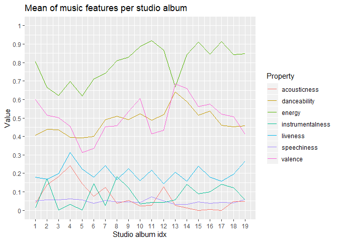
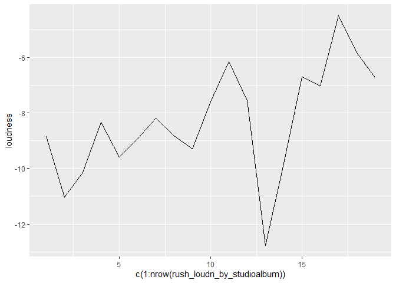

Portfolio plan: Analysis of Rush
================

**Computational Musicology 2020**

**Jesper Kuiper, 12984787**

The Canadian band [Rush](https://bit.ly/2HkT2Sx) is at its heart a rock
band. However, during the extensive lifetime of Rush, its music found a
lot of influence from a wide scope of genres and music styles. With a
lifespan of more than 40 years and a total of 19 studio albums, a lot
has changed from begin to end. In this portfolio, I will try to analyze
the way Rush’s music changed over the years, and I will try to determine
different style periods accross its albums. Furthermore, I will look at
how different genres apply to different eras of Rush.

## The corpora

Of course, the most important corpus I will use is that containing the
audio features of the entire discography of Rush itself. Upon initial
inspection, I decided to remove the album “2112 - 40 Years Closer: A
Q\&A With Alex Lifeson And Terry Brown Commentary” as it contains
commentary and is thus not relevant to my analysis. Furthermore, I
looked at different genres that are said to be part of at least some era
of Rush. For each of these genres I collected the audio features of a
playlist that seemed most representative for that genre. I chose
playlists of the following genres:

  - Rock:
      - 70s Rock Anthems
      - 80s Rock Anthems
      - 90s Rock Anthems
      - 00s Rock Anthems
  - Progressive Rock (user-made playlist)
  - Pop Rock (Pop Rock Shot)
  - Reggae (Reggae Classics)
  - New Wave (Is it New Wave?)
  - Jazz (Jazz Classics)
  - Metal (Metal Essentials)
  - Symphonic Metal (user-made playlist)

I chose a total of four playlists for the Rock genre, so that I can
analyse whether Rush followed the general trend of rock music through
the years.

## Initial analysis

I analyzed the audio features of each studio album of Rush, to see
whether there are some easily spottable trends in there. The studio
albums are, in order of release date:

1.  Rush (1974)
2.  Fly By Night (1975)
3.  Caress of Steel (1975)
4.  2112 (1976)
5.  A Farewell to Kings (1977)
6.  Hemispheres (1978)
7.  Permanent Waves (1980)
8.  Moving Pictures (1981)
9.  Signals (1982)
10. Grace Under Pressure (1984)
11. Power Windows (1985)
12. Hold Your Fire (1987)
13. Presto (1989)
14. Roll The Bones (1991)
15. Counterparts (1993)
16. Test For Echo (1997)
17. Vapor Trails (2002)
18. Snakes & Arrows (2007)
19. Clockwork Angels (2012)

<!-- -->

This initial plot looks promising; we can see at least the *energy*,
*valence* and *danceability* following some kind of a pattern here.
Interestingly, we can see a dip in *energy* and a peak in both
*danceability* and *valence* at the 13th studio album. It seems like
Rush tried to do something different in that album. This could indeed be
what happened, as this album - Presto - wasn’t received very well by the
general public. It seems Rush learned from this, as, according to my
plot, they seem to return to their ‘roots’ in their later albums.

<!-- -->
